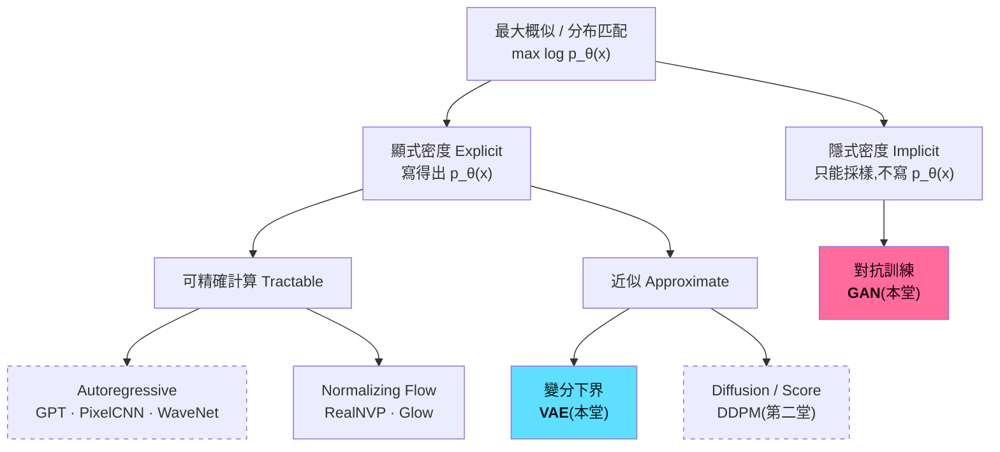
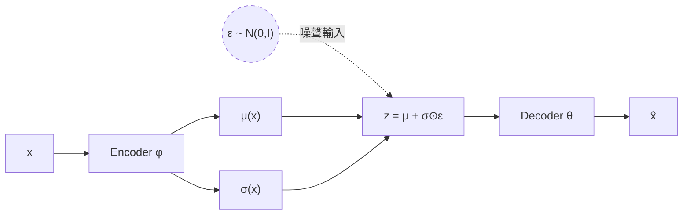
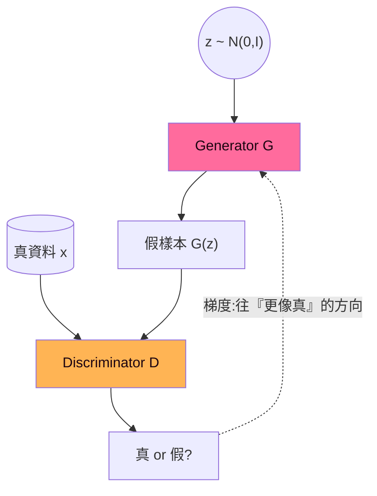
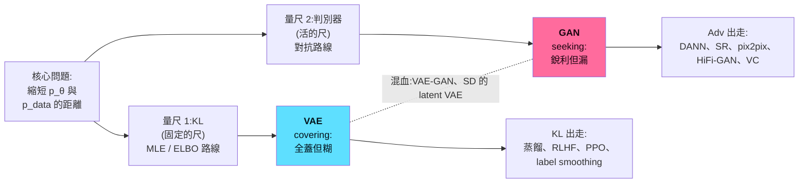

生成模型入門 · Lecture 01 · Lab Demo 01–03

# 生成學習入門 · 第一堂

## 從「採樣」出發:VAE、GAN,與兩把可攜帶的損失函數

生成模型入門課程 · 90 分鐘 
先修:機率與資訊理論 / 反向傳播 / 訓練學理 / CNN 與序列 / Transformer

Demo:瀏覽器內即時訓練的 2D 玩具資料(TensorFlow.js)

<!--
開場 30 秒:「前五堂你們學的是『判別』——給輸入預測標籤。今天開始我們換一個問題:不給輸入,直接生出資料本身。」

本堂主線只有一句話:生成模型 = 學會量測並縮短「模型分布」與「資料分布」之間的距離。KL 給我們 likelihood 路線(VAE),對抗給我們 implicit 路線(GAN)。
-->

---
layout: two-cols
---

# 今日地圖(90 分鐘)

| 時間 | 段落 |
|---|---|
| 0–5 | 開場與工具回收 |
| 5–15 | ① 什麼是「生成」?採樣的視角 |
| 15–27 | ② 顯式 vs 隱式:生成模型分類法 |
| 27–52 | ③ VAE:推導、**Demo 01**、缺陷與改進 |
| 52–77 | ④ GAN:對抗、**Demo 02**、缺陷與改進 |
| 77–82 | ⑤ VAE vs GAN 總對照 |
| 82–90 | ⑥ 兩把 loss 的跨領域旅行 + **Demo 03** 交棒 |

::right::

### 三個現場 Demo

1. **β-VAE 2D**:重建 vs KL 的拉鋸
2. **GAN 2D**:判別器地景與 mode collapse
3. **Flow Matching 2D**:第二堂的預告片

附註:Diffusion (DPM) 與 Autoregressive (AR) 模型本堂只做概覽定位,<b>第二堂詳述</b>。

<!--
時間彈性:若只有 60 分鐘,砍法是 ②壓到 6 分鐘(只留 taxonomy 一張+比較表)、VAE/GAN 的「改進研究」各留一張總表、⑥留語音案例。若有 120 分鐘,demo 可以讓學生自己開連結操作 5–10 分鐘。
-->

---

# 工具回收:你已經會的,今天全部用得上

| 第幾堂學的 | 工具 | 今天用在哪 |
|---|---|---|
| 第一堂 | **KL divergence** 與其非負性、不對稱性 | VAE 的正則項;mode-covering vs mode-seeking 解釋 VAE 糊 / GAN 漏 |
| 第一堂 | **Jensen 不等式** | ELBO 下界推導的關鍵一步 |
| 第一堂 | **MLE = 最小化 cross-entropy = 最小化 KL** | 「顯式建模」整條路線的出發點 |
| 第二堂 | 反向傳播與計算圖 | reparameterization trick 為什麼必要 |
| 第五堂 | **Autoregressive 生成、causal mask** | 你已經見過一個顯式生成模型:GPT! |
| 緩衝期 | 邊際化困難 $p(x)=\int p(x\mid z)\,p(z)\,dz$ | VAE 的存在理由 |

今天不會出現新的數學工具,全部是舊工具的新舞台。

<!--
這張是給學生安全感的:名詞聽起來很多(ELBO、adversarial、Wasserstein…),但數學地基全部已經教過。特別點名:GPT 的 next-token prediction 就是 autoregressive 的顯式密度模型,他們其實已經訓練過生成模型了。
-->

---
layout: section
class: sec-intro
---

# ① 什麼是「生成」?

## 從判別到採樣

<!--
5–15 分鐘。
-->

---

# 判別 vs 生成:學的是不同的機率物件

### 判別式模型(前五堂)

$$p(y \mid x)$$

- 給定輸入 $x$,預測標籤 $y$
- 只需要學 **決策邊界**
- 輸出空間小(類別數、迴歸值)
- 例:分類器、logistic regression、BERT 微調

### 生成式模型(今天起)

$$p(x) \quad \text{或} \quad p(x \mid y)$$

- 學 **資料本身的分布**
- 目標是能 **採樣**:$x_{\text{new}} \sim p_\theta(x)$
- 輸出空間 = 整個資料空間(百萬像素、整段語音)
- 例:VAE、GAN、GPT、diffusion

**生成 = 造一台「分布的採樣機」**:給我噪聲或提示,吐出一個看起來像從真實資料分布抽出來的新樣本。

<!--
畫在黑板上:判別是在資料點之間畫一條線;生成是要把每一個資料點「住在哪裡、密度多高」全部摸清楚,還要能從裡面抽出新的點。

提問:「GPT 是判別還是生成?」——生成:它學 p(下一個 token | 前文),鏈起來就是整段文字的 p(x)。
-->

---

# 為什麼生成比判別難?

<v-clicks>

- **輸出維度爆炸**:判別輸出 10 類的機率;生成要輸出 $256^{3\times512\times512}$ 種可能影像中「合理」的那一小撮
- **資料躺在低維流形上**:高維空間中幾乎處處密度為 0,模型必須精準找到那條又薄又彎的流形
- **沒有唯一正確答案**:同一個 $z$ 或同一句 prompt,可以對應無限多合理輸出,loss 必須容忍多模態(multi-modality)
- **要覆蓋整個分布**:判別只要邊界附近對就好;生成漏掉任何一個 mode 都是缺陷
- **評估困難**:分類有 accuracy;「生得好不好」連量尺都要另外發明(之後會遇到 FID)

</v-clicks>

**本堂主線**:所有生成模型都在回答同一題:<b>怎麼量、怎麼縮短 $p_\theta$ 與 $p_{\text{data}}$ 的距離?</b> 
量尺選得不同,家族就長得不同。

<!--
「多模態」這點是 VAE 模糊成因的伏筆:當一個輸入對應多個合理輸出、而你的 loss 是 MSE 時,最優解是把它們平均起來——平均臉、平均月亮,就是糊。

主線句請學生記下來,之後每個模型出場都會回到這句話:VAE 選 KL(透過 MLE)、GAN 選 JS(透過判別器)、WGAN 選 Wasserstein、FM/diffusion 選一條傳輸路徑。
-->

---

# 生成模型能做的任務型態

| 任務 | 數學物件 | 例子 |
|---|---|---|
| **無條件生成** | $x \sim p_\theta(x)$ | 生成人臉、生成語音波形 |
| **條件生成** | $x \sim p_\theta(x \mid y)$ | 文生圖、TTS(文字→語音)、超解析度 |
| **密度估計** | 算出 $p_\theta(x)$ 的值 | 異常偵測、資料壓縮、模型比較 |
| **表示學習** | 推斷 $z \sim q(z \mid x)$ | 學到有語意的潛在空間、下游任務特徵 |
| **編輯/翻譯** | $p_\theta(x' \mid x)$ | 風格轉換、voice conversion、inpainting |

注意:**不是每個家族五項全能**。GAN 生得銳利卻算不出密度;VAE 有優雅的 $z$ 卻生得糊;AR 密度精確卻採樣慢。所以需要一張分類地圖。

<!--
語音實驗室錨點:條件生成一列刻意放了 TTS,編輯一列放了 voice conversion——這些之後都會回來。
-->

---
layout: section
class: sec-tax
---

# ② 顯式 vs 隱式

## 生成模型的分類法與家族概覽

<!--
15–27 分鐘。本段目標:給一張地圖,讓 VAE/GAN 有座標;DPM/AR 只定位、不深講(第二堂)。
-->

---

# Goodfellow 的分類樹(NIPS 2016 Tutorial)

以「模型如何對待 $p_\theta(x)$」分類:

虛線框 = 第二堂詳述(AR、Diffusion)。Flow matching 是 flow/diffusion 的現代統一觀點,課末 Demo 03 先給你看。

<!--
帶讀這棵樹:
- 顯式可精確:直接把 p(x) 寫成可算的形式。AR 用 chain rule 拆成 ∏p(x_i|x_<i)——「你們訓練 GPT 用的 cross-entropy 就是在做這件事」。Flow 用可逆變換+change of variables。代價:架構被密度可算性綁架(必須自迴歸或必須可逆)。
- 顯式近似:p(x) 積分算不動,退而求其次最佳化一個下界(VAE)或變分過程(diffusion)。
- 隱式:乾脆放棄寫 p(x),只造採樣機,用另一個網路(判別器)當距離量尺。
出處:Goodfellow, "NIPS 2016 Tutorial: Generative Adversarial Networks" (arXiv:1701.00160)。
-->

---

# 六大家族一頁概覽

| 家族 | 密度 $p_\theta(x)$ | 樣本品質 | 採樣速度 | 訓練穩定性 | Mode 覆蓋 | 一句話 |
|---|---|---|---|---|---|---|
| **Autoregressive**(第二堂) | 精確 | 高 | 慢:逐 token | 穩(就是 MLE) | 好 | 用 chain rule 拆解,GPT 即是 |
| **Normalizing Flow** | 精確 | 中 | 快:一步 | 穩 | 好 | 可逆變換 + Jacobian |
| **VAE**(本堂) | 只有下界 | 偏糊 | 快:一步 | 穩 | 好 | 變分推斷 + 潛在空間 |
| **GAN**(本堂) | 無 | 銳利 | 快:一步 | 不穩 | 易漏 | 對抗賽局當距離量尺 |
| **Diffusion**(第二堂) | 下界/ODE | 極高 | 慢:多步 | 穩 | 好 | 逐步去噪 |
| **Flow Matching**(預告) | ODE 可算 | 高 | 多步,可壓少 | 穩(回歸) | 好 | 學速度場搬運分布 |

**Generative Learning Trilemma**(Xiao et al., ICLR 2022):<b>樣本品質、採樣速度、mode 覆蓋(多樣性)</b>:經典模型頂多同時拿到兩個。GAN 犧牲覆蓋、VAE 犧牲品質、diffusion 犧牲速度。近年研究(latent diffusion、蒸餾、FM 少步採樣)都在攻這個三角。

<!--
這張表是本堂的「地圖」,之後 VAE/GAN 各講完會回來打勾對照。

Trilemma 出處:Xiao, Kreis & Vahdat, "Tackling the Generative Learning Trilemma with Denoising Diffusion GANs", ICLR 2022 (arXiv:2112.07804)。

提問:「為什麼 AR 又穩、密度又精確,大家還要搞別的?」——答:採樣是序列式的,一張 512×512 影像 = 26 萬次前向;而且沒有天然的潛在空間可以編輯。這也是第二堂 AR 的討論起點。
-->

---

# 顯式 vs 隱式:優缺點總結

### 顯式建模(likelihood-based)

**優點**
- 訓練目標有原則:MLE = 最小化 $\mathrm{KL}(p_{\text{data}}\,\|\,p_\theta)$(第一堂!)
- 可比較模型、可做壓縮與異常偵測
- 穩定:單一目標函數往下壓就對了
- KL 這個方向 → **mode-covering**:漏 mode 會被重罰

**代價**
- 密度可算性綁架架構(可逆 / 自迴歸 / 下界)
- 為覆蓋所有資料,傾向把機率「抹開」→ 樣本偏糊

### 隱式建模(GAN 系)

**優點**
- 架構完全自由:任何 $G: z \mapsto x$ 都行
- 一步生成、樣本銳利
- 距離量尺(判別器)是「學出來的」,對感知品質敏感

**代價**
- 算不出 $p_\theta(x)$,無法密度估計
- 兩人賽局而非最佳化 → 不穩、mode collapse
- 行為近似 **mode-seeking**:抓到幾個 mode 就能騙過 D

<!--
把第一堂的 KL 不對稱性正式接上:
- MLE 最小化 forward KL(data‖model):凡是 data 有質量、model 沒質量的地方,懲罰無限大 → 必須覆蓋所有 mode → covering → 糊。
- GAN 的有效行為接近 reverse KL / JS:model 只要待在 data 高密度區就低 loss → seeking → 銳利但漏群。
第一堂 live coding 畫過的「單峰 Q 逼近雙峰 P」那張圖,就是今天 VAE vs GAN 的預言。
-->

---
layout: section
class: sec-vae
---

# ③ VAE

## 變分自編碼器:用下界馴服邊際化

<!--
27–52 分鐘(含 Demo 01 約 7 分鐘)。
-->

---

# 動機:潛在變數模型與它的邊際化困難

**想法**:資料 $x$ 由看不見的低維因子 $z$ 生成(緩衝期預習過):

$$p_\theta(x) = \int p_\theta(x \mid z)\, p(z)\, dz, \qquad p(z) = \mathcal{N}(0, I)$$

<v-clicks>

- $p(z)$:簡單先驗,好採樣;$p_\theta(x\mid z)$:神經網路 decoder
- **採樣很容易**:抽 $z$、過 decoder,完成
- **訓練很困難**:MLE 需要 $\log p_\theta(x)$,但這個積分在 $z$ 連續、decoder 非線性時 **intractable**
- 蒙地卡羅?$p_\theta(x) \approx \frac{1}{K}\sum_k p_\theta(x\mid z_k),\ z_k\sim p(z)$:高維時幾乎所有 $z_k$ 都與 $x$ 無關,變異數爆炸

</v-clicks>

**破局點**:與其亂槍打鳥,不如訓練一個「偵察兵」$q_\phi(z\mid x)$,直接告訴我們哪些 $z$ 可能生出這個 $x$。這就是 encoder,也是「變分」二字的由來。

<!--
講稿:強調「生成方向容易、推斷方向困難」的不對稱。encoder 不是為了壓縮而生,是為了讓 MLE 變得可算而生——這個因果順序講清楚,學生才不會把 VAE 當成「AE 加了噪聲」。
-->

---

# ELBO:一行 Jensen,換一個可訓練的下界

$$
\begin{aligned}
\log p_\theta(x) &= \log \int p_\theta(x\mid z)\,p(z)\,dz
= \log\, \mathbb{E}_{q_\phi(z\mid x)}\!\left[\frac{p_\theta(x\mid z)\,p(z)}{q_\phi(z\mid x)}\right] \\[4pt]
&\ge \mathbb{E}_{q_\phi(z\mid x)}\!\left[\log \frac{p_\theta(x\mid z)\,p(z)}{q_\phi(z\mid x)}\right] \qquad \text{(Jensen,log 是凹函數 → 第一堂)} \\[4pt]
&= \underbrace{\mathbb{E}_{q_\phi(z\mid x)}\big[\log p_\theta(x\mid z)\big]}_{\text{重建項}} \;-\; \underbrace{\mathrm{KL}\big(q_\phi(z\mid x)\,\|\,p(z)\big)}_{\text{正則項}} \;=\; \mathrm{ELBO}
\end{aligned}
$$

<v-clicks>

- 更精確的等式:$\log p_\theta(x) = \mathrm{ELBO} + \mathrm{KL}\big(q_\phi(z\mid x)\,\|\,p_\theta(z\mid x)\big)$ → 間隙 = 偵察兵的不準度;KL ≥ 0(第一堂證過)保證它是下界
- **重建項**:encoder 選的 $z$ 要能還原 $x$(Gaussian decoder 時 = $-$MSE)
- **KL 項**:整團 $q$ 要貼近先驗 $\mathcal{N}(0,I)$,否則「訓練時走過的 $z$」和「生成時抽的 $z$」對不上

</v-clicks>

<!--
板書建議:把 Jensen 那一步放大寫一次,請一位學生說出「為什麼不等號方向是 ≥」(log 凹 → E[log] ≤ log E,取在分母的形式後方向翻轉為下界)。這正是第一堂驗收過的內容。

第二個 bullet 是很多教材略過但概念上最重要的:ELBO 與 log p(x) 的差距恰好是 q 對真後驗的 KL。q 越準、下界越緊。
-->

---

# Reparameterization Trick

**問題**:重建項要對「抽樣自 $q_\phi$」求梯度,但 $z \sim \mathcal{N}(\mu_\phi, \sigma_\phi^2)$ 的抽樣節點不可微(第二堂:計算圖上斷了)。

**解法**:把隨機性搬到輸入端

$$z = \mu_\phi(x) + \sigma_\phi(x) \odot \varepsilon,\quad \varepsilon \sim \mathcal{N}(0, I)$$

- $\varepsilon$ 是常數般的外部噪聲,梯度沿 $\mu, \sigma$ 直通 encoder
- 高斯 $q$ 對高斯先驗的 KL 有閉式解,整個 ELBO 端到端可微

梯度可以從 x̂ 一路流回 μ、σ(實線);隨機性被隔離在虛線節點,不需要對它微分。

<!--
一句話總結給學生:「不是對『骰子』微分,而是把骰子丟到模型外面,模型只負責平移和縮放骰子的結果。」

延伸(有人問再說):離散 z 不能這樣做 → Gumbel-softmax 或 VQ-VAE 的 straight-through,這是等下 VQ-VAE 的伏筆。
-->

---

# β-VAE:把拉鋸變成一顆旋鈕

$$\mathcal{L}_{\beta} = \underbrace{\mathbb{E}_{q_\phi}\big[\log p_\theta(x\mid z)\big]}_{\text{重建:還原得像}} \;-\; \beta \cdot \underbrace{\mathrm{KL}\big(q_\phi(z\mid x)\,\|\,p(z)\big)}_{\text{正則:貼近先驗}}$$

| $\beta$ | 行為 | 代價 |
|---|---|---|
| $\beta = 0$ | 退化成普通 Autoencoder:重建極準 | 潛在空間四散,從先驗採樣落在「沒學過」的區域,**生成崩壞** |
| $\beta = 1$ | 標準 VAE(正宗 ELBO) | 重建與生成的折衷 |
| $\beta \gg 1$ | 潛在空間被硬壓成 $\mathcal{N}(0,I)$,鼓勵 disentanglement | 重建劣化、樣本糊成一團;**posterior collapse** 前兆 |

接下來直接轉這顆旋鈕:<b><a href="/public/demos/vae-2d-interactive.html" target="_blank">Demo 01</a></b>

<!--
β-VAE 原始動機是 disentanglement(Higgins et al., ICLR 2017),但在教學上它是把 ELBO 兩項拉鋸「可視化」的最好工具,demo 就是這樣設計的。
-->

---

# VAE 的缺陷 ①:為什麼糊?

<v-clicks>

- **Gaussian likelihood = MSE**: $\log p_\theta(x\mid z) \propto -\|x - \hat{x}_\theta(z)\|^2$。當一個 $z$ 對應多個合理輸出時,MSE 的最優解是它們的**平均** → 平均臉沒有毛孔、平均月亮是一條霧
- **Mode-averaging 疊加 KL 的 covering 壓力**:MLE 路線必須覆蓋所有資料(第一堂:forward KL 罰漏不罰糊),decoder 又是連續函數、要把整個先驗鋪滿資料 → 群與群之間留下「橋」
- 剛剛 demo 的 2D 版本:高斯混合中間的低密度輸出、圓環上的缺口,就是這兩股力的合成

</v-clicks>

<b>缺陷 ②:posterior collapse</b> decoder 太強(或 β 太大)時,q(z|x) 塌回先驗、z 被忽略,潛在空間學了個寂寞。序列 decoder(語音/文字)特別常見。

<b>缺陷 ③:prior hole</b> aggregated posterior q(z)=E_x[q(z|x)] 與 p(z) 不匹配:先驗裡有「沒人住過」的洞,採樣踩到洞就生出垃圾。

<b>缺陷 ④:下界間隙</b> 優化的是 ELBO 不是 log p(x);q 家族太簡單(對角高斯)時間隙大,density estimate 偏保守。

<!--
「糊」的成因給兩層:損失層(MSE 平均化)與路線層(covering)。demo 的「橋」同時展示了兩者。

Posterior collapse 的語音錨點:用 autoregressive decoder(如 WaveNet decoder)做 VAE 時,decoder 自己就能把資料建模得很好,乾脆忽略 z——KL 項歸零、z 失效。這是語音表示學習的實際痛點。
-->

---

# VAE 的後續改進:對症下藥

| 缺陷 | 改進 | 代表工作 | 一句話 |
|---|---|---|---|
| 樣本糊 | 離散潛在空間 + 強 decoder | **VQ-VAE** (2017) / **VQ-VAE-2** (2019) | z 改成 codebook 查表,交給 AR prior 生成;催生 DALL·E 路線 |
| 樣本糊 | 疊深層次潛在變數 | **NVAE** (2020)、**VDVAE** (2021) | hierarchical VAE:多層 z 逐級細化;這個形狀第二堂 diffusion 會再見 |
| 樣本糊 | 借判別器的感知量尺 | **VAE-GAN** (2016) | 重建項換成 GAN 的 feature-level loss(本堂稍後的伏筆) |
| prior hole | 學出來的先驗 | **VampPrior** (2018) | 先驗改成 pseudo-inputs 的 posterior 混合,填洞 |
| posterior collapse | KL annealing / free bits | (訓練技巧系) | 前期關小 KL、或給每維 KL 保底 |
| disentanglement | 加重 KL / 分解 KL | **β-VAE** (2017)、FactorVAE | 換取可解釋的因子軸 |

**VAE 的現代角色**: Stable Diffusion 的第一層就是一顆(對抗式訓練的)VAE,先把影像壓進 latent space,diffusion 才在低維空間跑。這條研究線沒有消失,它變成了別人的第一層。

<!--
不必逐列細講,挑 VQ-VAE 與 NVAE 兩個講 30 秒:
- VQ-VAE:把「連續 z + 高斯先驗」整組換成「離散 codebook + 學出來的 AR 先驗」,一次繞開糊(likelihood 交給強 decoder/prior)與 prior hole(先驗是學的)。
- NVAE/VDVAE:證明純 VAE 認真做架構也能生成高解析人臉;更重要的是 hierarchical 形狀是 diffusion 的前身——第二堂的伏筆。
SD 的 VAE 其實是 VAE-GAN 混合(KL 正則 + patch 判別器 + LPIPS),正好呼應本堂兩條路線的合流。
-->

---
layout: section
class: sec-gan
---

# ④ GAN

## 生成對抗網路:讓量尺自己長出來

<!--
52–77 分鐘(含 Demo 02 約 7 分鐘)。
-->

---

# 核心想法:不寫密度,改請一位「鑑定師」

**放棄** $p_\theta(x)$,只造採樣機 $G: z \mapsto x$。
但沒有密度就沒有 MLE。**距離量尺哪裡來?**

**答案**:再訓練一個判別器 $D$,專門分辨真假:

$$\min_G \max_D \; \mathbb{E}_{x\sim p_{\text{data}}}[\log D(x)] + \mathbb{E}_{z\sim p(z)}[\log(1 - D(G(z)))]$$

<v-clicks>

- $D$:把真的判 1、假的判 0(就是 binary cross-entropy,第二堂推導過梯度)
- $G$:唯一的學習訊號 = **穿過 D 傳回來的梯度**。沒有 encoder、沒有重建、沒有 pixel-level 目標
- 實作用 **non-saturating loss**:$G$ 改最大化 $\log D(G(z))$:早期 $D$ 太準時 $\log(1-D)$ 飽和沒梯度

</v-clicks>

偽鈔犯 vs 警察:兩人互相變強,直到警察再也分不出真假;平衡時 $D \equiv 0.5$。

<!--
關鍵對比句:「VAE 用一把『固定的量尺』(MSE/likelihood);GAN 把量尺本身也變成神經網路,跟著資料一起學。」量尺會學到人眼在意的特徵(紋理、銳利度)——這是 GAN 樣本銳利的來源;量尺會動——這是 GAN 不穩的來源。一體兩面。
-->

---

# 理論:最優判別器把 minimax 變成 JS divergence

固定 $G$,對每個 $x$ 求 $\max_D$ 有閉式解:

$$D^*(x) = \frac{p_{\text{data}}(x)}{p_{\text{data}}(x) + p_g(x)}$$

<v-click>

代回目標函數:

$$C(G) = -\log 4 + 2\,\cdot\,\mathrm{JSD}\big(p_{\text{data}} \,\|\, p_g\big), \qquad \mathrm{JSD}(p\|q) = \tfrac{1}{2}\mathrm{KL}\big(p\,\|\,m\big) + \tfrac{1}{2}\mathrm{KL}\big(q\,\|\,m\big),\; m = \tfrac{p+q}{2}$$

</v-click>

<v-clicks>

- **理想情況下**,GAN 在最小化 JS divergence(一個對稱化的 KL)。全域最優解唯一:$p_g = p_{\text{data}}$,此時 $D^* \equiv \frac{1}{2}$
- **但理想很脆弱**:兩個分布都躺在低維流形上、幾乎不重疊時,JSD 恆為 $\log 2$ → **梯度消失**;而且我們從未真的把 $D$ 訓練到最優;實務是兩個網路交替走一步的**賽局動力學**,會震盪、會繞圈
- 沒有單一目標函數在下降 → **loss 曲線不可讀**,健康訊號要看 $D(\text{real}), D(\text{fake}) \to 0.5$

</v-clicks>

這些病症等一下全部看得到:<b><a href="/public/demos/gan-2d-interactive.html" target="_blank">Demo 02</a></b>

<!--
板書:D*(x) 的推導只需要對 a·log y + b·log(1−y) 求極值,y* = a/(a+b),一行就完成,可以請學生口頭推。

「不重疊 → JSD 卡死」正是 WGAN 的動機,先在這裡種下,兩張投影片後收割。
-->

---

# GAN 的缺陷:一體兩面的代價

| 缺陷 | 機制 | 剛剛在 demo 看到的 |
|---|---|---|
| **Mode collapse** | seeking 行為:守住少數 mode 即可騙過 D,漏群不受罰;G 甚至在群間跳動 | 白點只蓋 2~3 群、網格塌縮、mode hopping |
| **訓練不穩定** | 賽局動力學:交替更新會震盪繞圈;D 太強 → JSD 飽和、G 梯度消失 | kD=5 時 G 卡死;loss 曲線互相拉扯 |
| **無法估計密度** | 隱式模型,$p_g(x)$ 寫不出來 | (原理性缺陷,demo 之外) |
| **評估困難** | 沒有 likelihood 可報,只能發明代理量尺:**IS**、**FID**(Inception 特徵上的分布距離) | loss 不可讀 → 需要外部量尺 |

銳利和不穩是同一個設計的兩面:<b>量尺是活的</b>。之後十年的 GAN 研究,大半在想辦法讓這把量尺安分,同時不把銳利改掉。

<!--
FID 順帶一提即可(兩組樣本過 Inception 取特徵,擬合高斯後算 Fréchet 距離),第二堂評估生成模型時會再正式用到。

過場:改進研究依「動的是哪裡」分兩張——動距離/正則,與動架構/工程。
-->

---

# GAN 的改進 (1):換距離、加約束

| 工作 | 年份 | 對付什麼 | 怎麼做 |
|---|---|---|---|
| **WGAN** | 2017 | 不重疊 → JSD 飽和、梯度消失 | 換成 Wasserstein 距離 $W_1(p,q)=\sup_{\|f\|_L\le 1}\mathbb{E}_p[f]-\mathbb{E}_q[f]$:分布不重疊也給出平滑、有意義的梯度;D 變成不設上限的 critic |
| **WGAN-GP** | 2017 | weight clipping 太粗暴 | 用 gradient penalty $(\|\nabla_{\hat{x}} f\|-1)^2$ 軟性施加 Lipschitz 約束 |
| **Spectral Norm (SNGAN)** | 2018 | 同上,更便宜 | 每層權重除以其最大奇異值,直接控制 D 的 Lipschitz 常數 |
| **R1 penalty** | 2018 | 收斂性 | 只在真資料上懲罰 $\|\nabla_x D\|^2$;局部收斂有理論保證,StyleGAN 全系列採用 |

**共同哲學**:病根在量尺:兩個分布不重疊時,JS 給不出可用的梯度。把量尺換成 Wasserstein(搬土距離:把 $p_g$ 的土搬成 $p_{\text{data}}$ 的形狀要花多少力氣),或把 D 的地景**強制變平緩**(Lipschitz),G 就永遠有坡可爬。回想 demo:kD=5 時那片又暗又陡的地景,就是這些方法要鏟平的東西。

<!--
Wasserstein 直覺用「搬土」講:兩座不重疊的土堆,JS 只會說「完全不同」(log2,無梯度);W 距離會說「相距 5 公尺」——距離變近就有獎勵,G 才有路標。

「demo 那片又暗又陡的地景」是本張的錨:學生剛親眼看過梯度劣化,現在給藥方。
-->

---

# GAN 的改進 (2):架構與工程的十年

| 工作 | 年份 | 貢獻 |
|---|---|---|
| **cGAN** | 2014 | 條件生成:G、D 都吃標籤 y → 可控生成的起點 |
| **DCGAN** | 2015 | 卷積架構設計準則,GAN 第一次穩定生出像樣的圖 |
| **Progressive GAN** | 2017 | 從 4×4 逐步長到 1024×1024:先學佈局再學細節 |
| **StyleGAN 1/2/3** | 2018–21 | style-based 生成器:z→w 空間、AdaIN 逐層注入;2 修 artifacts、3 修 aliasing;人臉生成的代名詞 |
| **BigGAN** | 2018 | 大 batch + 大模型 + truncation trick:類別條件 ImageNet 生成 |

**GAN 的現代角色**:一步生成、樣本銳利,適合需要快、對品質敏感、又不要求全覆蓋的場合:

- **超解析度**:SRGAN / **ESRGAN**(對抗 loss 補回 MSE 抹掉的高頻紋理)
- **Image-to-image**:pix2pix(成對)、**CycleGAN**(不成對 + cycle consistency)
- **語音 vocoder**:MelGAN、**HiFi-GAN**,即時神經聲碼器的主流(下一段主角)
- 以及:當 VAE / diffusion 的**感知品質補丁**(SD 的 VAE 就是對抗式訓練的)

<!--
這張不逐列講,30 秒帶過表格,重點放在下半:GAN 作為「元件」而非「主角」活得非常好——這直接過渡到第 ⑥ 段「loss 的可攜性」。

StyleGAN 若有人問 w 空間:z 先過 MLP 映到 w,解開 z 空間的糾纏,讓逐層 style 注入可以分離粗細粒度屬性。
-->

---
layout: section
class: sec-vs
---

# ⑤ VAE vs GAN

## 同一份資料,兩種世界觀

---

# 總對照:likelihood vs adversarial

| | **VAE** | **GAN** |
|---|---|---|
| 距離量尺 | KL(經由 MLE / ELBO),固定的尺 | JS / 學出來的判別器,活的尺 |
| 行為模式 | mode-**covering**:每群都蓋,代價是糊、有橋 | mode-**seeking**:蓋到的銳利,代價是漏群 |
| 訓練 | 單一目標,穩定下降 | 兩人賽局,震盪、可能不收斂 |
| 密度 | 有下界(可比較、可偵測異常) | 無 |
| 潛在空間 | 有 encoder,天生做表示學習 | 無 encoder(要另外 inversion) |
| 樣本品質 | 偏糊 | 銳利 |
| 2D demo 印記 | 高斯混合的「橋」、圓環缺口 | 漏群、mode hopping、地景陡峭 |

**回收第一堂**:這整張表是「KL 不對稱性」的工程版。forward KL(MLE)罰漏不罰糊 → covering;reverse KL / JS 罰糊不罰漏 → seeking。你們在第一堂 live coding 畫的「單峰 Q 追雙峰 P」,今天長成了兩個模型家族。

<!--
「中心偏移高斯混合」是三個 demo 共用的對照組:VAE 搭橋、GAN 漏群、(等下 Demo 03)FM 乾淨分群但要多步積分。同一份資料,三種行為。如果時間充裕,可以現場把兩個 demo 分頁並排。
-->

---
layout: section
class: sec-loss
---

# ⑥ 兩把 loss 的跨領域旅行

## 同一個 loss,換一個舞台

<!--
82–90 分鐘(含 Demo 03 交棒)。核心觀念:KL 與 adversarial loss 是「分布距離的量尺」,任何任務只要能表述成「讓兩個分布接近/不可分」,就能直接搬用。
-->

---

# KL loss 的旅行:凡是「向一個分布看齊」的地方

| 領域 | 用法 | 誰跟誰算 KL |
|---|---|---|
| **知識蒸餾** (Hinton 2015) | 小模型模仿大模型的 soft label:$\mathrm{KL}\big(p_T^{(\tau)}\,\|\,p_S^{(\tau)}\big)$(帶溫度 $\tau$) | 學生輸出分布 ← 教師輸出分布 |
| **RLHF / DPO** | reward 最大化 + $\beta\,\mathrm{KL}(\pi_\theta\,\|\,\pi_{\text{ref}})$ 懲罰:別為了討好 reward 忘了怎麼說人話 | 微調後政策 ← 原始 LM |
| **TRPO / PPO** | 每步更新限制 $\mathrm{KL}(\pi_{\text{old}}\,\|\,\pi_{\text{new}})$:政策別一步跳太遠 | 新政策 ← 舊政策 |
| **Label smoothing / 校準** | 目標從 one-hot 改成平滑分布,等價於加一項對均勻分布的 KL | 模型輸出 ← 平滑目標 |
| **變分推斷**(VAE 本尊) | $\mathrm{KL}(q\,\|\,p)$ 正則 | 近似後驗 ← 先驗 |

共同句型:<b>「我有一個參考分布,請新分布別離它太遠。」</b>方向也有講究:KL 的不對稱性(第一堂)決定了是 covering 還是 seeking 的看齊方式。你們之後做 LLM 對齊、RL、蒸餾,都會再遇到這一項。

<!--
挑 2 個細講:
- 蒸餾:soft label 攜帶「類別之間的相似結構」(這張 3 有點像 8),比 one-hot 資訊多;溫度 τ 把分布抹軟,放大暗知識。
- RLHF:沒有 KL 項會 reward hacking(語言退化);β 就是 β-VAE 那顆旋鈕的親戚——正則強度。學生若走 LLM 方向,這是第一個會親手調的 KL。
-->

---

# Adversarial loss 的旅行:凡是「要騙過一個分類器」的地方

| 領域 | 用法 | 判別器分辨什麼 |
|---|---|---|
| **Domain adaptation (DANN)** | 梯度反轉層 (GRL):特徵萃取器學到讓 domain 分類器分不出來源/目標域的特徵 | 特徵來自哪個 domain |
| **Image-to-image** (pix2pix / CycleGAN) | 對抗 loss 保證輸出落在目標域的分布;CycleGAN 加 cycle consistency 免成對資料 | 輸出是不是目標域真圖 |
| **超解析度** (SRGAN / ESRGAN) | MSE 只會給平均化的糊圖;對抗項把輸出推回「真實高解析影像的流形」 | 高解析圖是真拍的還是放大的 |
| **語音 vocoder** (MelGAN / **HiFi-GAN**) | mel-spectrogram → 波形;多尺度/多週期判別器 + feature matching loss | 波形是真錄音還是合成 |
| **Voice conversion** (CycleGAN-VC / StarGAN-VC) | 不成對語者轉換:對抗 loss 對齊目標語者分布 + cycle 保留語言內容 | 這段語音像不像目標語者 |

共同句型:<b>「我寫不出『像真的』的公式,那就訓練一個分類器當量尺,然後騙過它。」</b>凡是品質難以用 pixel/sample 級 loss 描述的地方,對抗 loss 都是候選。

<!--
本實驗室語音方向,HiFi-GAN 多給 1 分鐘:
- 任務:mel-spectrogram → 44.1k/22.05kHz 波形。逐點 loss 對相位幾乎無能為力(同一 mel 對應多種合理相位——又是多模態!)。
- 解法:Multi-Period Discriminator(以不同週期摺疊波形,抓週期結構)+ Multi-Scale Discriminator(不同時間解析度)+ mel-spectrogram loss + feature matching loss。生成一步到位 → 即時合成。
- 這就是 GAN「快、銳利、不求密度」特性的完美用武之地——TTS pipeline 的最後一哩路。
DANN 的梯度反轉層值得一句:「min-max 不一定要兩個 optimizer 輪流,GRL 把 max 塞進同一次 backward——反向時把梯度乘上 −λ。」
-->

---

# 收束:一張圖記住今天

 

還有第三種做法:不量距離,直接學一條<b><a href="/demos/flow-matching-2d-interactive.html" target="_blank">把分布搬過去的路</a></b>。這是第二堂的主角,先看預告

<!--
「兩把量尺」收束後,用最後一句話開門:KL 和判別器都是「靜態地比較兩團點」;還有一個動態觀點——把生成看成「傳輸」,學一個速度場把 p₀ 一路流到 p₁。這就是 Demo 03。
-->

---

# 交棒第二堂:兩條伏筆已經埋好

### 伏筆 A:從 VAE 到 Diffusion

- NVAE 的 **hierarchical VAE**:多層 $z$ 逐級細化
- 把層數推到極限、每層只做「一點點去噪」、encoder 換成**固定的加噪過程** → 就是 **DDPM**
- ELBO 的推導技術(Jensen、KL 分解)全部沿用:diffusion 的訓練目標仍是一個變分下界

### 伏筆 B:你已經會 Autoregressive

- 第五堂的 GPT:$p(x)=\prod_i p(x_i \mid x_{<i})$,cross-entropy 訓練 = 顯式密度的 MLE
- 第二堂回答:為什麼 AR 統治了文字、卻在影像/語音上輸給 diffusion?(採樣速度、順序歸納偏置、連續 vs 離散)
- 以及 Demo 03 的正式版:flow matching / rectified flow 與 DDPM 的關係

**課後作業建議**:把三個 demo 都切到「中心偏移混合」,各截一張圖,用今天的語言寫 300 字解釋三者差異。

<!--
作業設計意圖:強迫學生用「covering / seeking / 傳輸」三個詞彙描述同一份資料上的三種行為——這是本堂的驗收點。

也可以出進階題:「β-VAE 的 β 和 RLHF 的 β 在數學上扮演什麼相同角色?」(都是 KL 正則強度,拉向參考分布)。
-->

---

# Take-home Messages

<v-clicks>

1. **生成 = 學一台採樣機**,核心問題是縮短 $p_\theta$ 與 $p_{\text{data}}$ 的距離;選什麼「量尺」決定你是哪一派
2. **顯式路線**(MLE/KL):有原則、穩定、covering,但密度可算性綁架架構,樣本偏糊;**隱式路線**(對抗):自由、銳利、seeking,但不穩、漏 mode、無密度
3. **VAE** = Jensen 不等式 + 一位偵察兵($q_\phi$):ELBO 兩項的拉鋸就是 β 那顆旋鈕;糊來自 MSE 平均化 + covering 壓力;VQ-VAE / NVAE / VampPrior 各自對症下藥,如今是 latent diffusion 的地基
4. **GAN** = 把量尺變成活的:銳利與不穩定同源;WGAN/SN/R1 馴服量尺,StyleGAN 把工程推到極致,如今在 SR、i2i、vocoder 等「快與真」的戰場當家
5. **loss 是可攜的**:KL =「向參考分布看齊」(蒸餾、RLHF、PPO);adversarial =「騙過一個分類器」(DANN、HiFi-GAN、VC)。我的偏見:模型會過時,這兩把尺不會
6. 下一堂:**多步生成**的世界:diffusion 與 autoregressive

</v-clicks>

<!--
逐條點擊帶過,每條 15 秒。最後把主線句再唸一次收尾。
-->

---
layout: two-cols
---

# 參考文獻 (1/2) — 主線

**分類法與總覽**
- Goodfellow, *NIPS 2016 Tutorial: GANs* — arXiv:1701.00160
- Xiao et al., *Tackling the Generative Learning Trilemma* (ICLR 2022) — arXiv:2112.07804

**VAE**
- Kingma & Welling, *Auto-Encoding Variational Bayes* (2013) — arXiv:1312.6114
- Rezende et al., *Stochastic Backprop & Approximate Inference* (2014) — arXiv:1401.4082
- Higgins et al., *β-VAE* (ICLR 2017)
- van den Oord et al., *VQ-VAE* (2017) — arXiv:1711.00937;*VQ-VAE-2* — arXiv:1906.00446
- Vahdat & Kautz, *NVAE* (2020) — arXiv:2007.03898
- Child, *Very Deep VAE* (2021) — arXiv:2011.10650
- Tomczak & Welling, *VampPrior* (2018) — arXiv:1705.07120
- Larsen et al., *VAE-GAN* (2016) — arXiv:1512.09300
- Rombach et al., *Latent Diffusion / SD* (2022) — arXiv:2112.10752

::right::

**GAN**
- Goodfellow et al., *GAN* (2014) — arXiv:1406.2661
- Mirza & Osindero, *cGAN* (2014) — arXiv:1411.1784
- Radford et al., *DCGAN* (2015) — arXiv:1511.06434
- Arjovsky et al., *WGAN* (2017) — arXiv:1701.07875
- Gulrajani et al., *WGAN-GP* (2017) — arXiv:1704.00028
- Miyato et al., *Spectral Normalization* (2018) — arXiv:1802.05957
- Mescheder et al., *R1 / Which GANs converge?* (2018) — arXiv:1801.04406
- Karras et al., *Progressive GAN* — arXiv:1710.10196;*StyleGAN* — arXiv:1812.04948;*StyleGAN2* — arXiv:1912.04958;*StyleGAN3* — arXiv:2106.12423
- Brock et al., *BigGAN* (2018) — arXiv:1809.11096
- Salimans et al., *IS* — arXiv:1606.03498;Heusel et al., *FID* — arXiv:1706.08500

<!--
提醒學生:年份以 arXiv 首發為準,正式發表場次(ICLR/NeurIPS)略有出入,引用時依情境標註——這是自學指南 Caveats 教過的習慣。
-->

---

# 參考文獻 (2/2) — Loss 的旅行與預告

**KL 的旅行**
- Hinton et al., *Knowledge Distillation* (2015) — arXiv:1503.02531
- Ouyang et al., *InstructGPT / RLHF* (2022) — arXiv:2203.02155
- Rafailov et al., *DPO* (2023) — arXiv:2305.18290
- Schulman et al., *TRPO* (2015) — arXiv:1502.05477;*PPO* (2017) — arXiv:1707.06347
- Szegedy et al., *Label Smoothing*(Inception-v3, 2015)— arXiv:1512.00567

**Adversarial 的旅行**
- Ganin et al., *DANN* (2015) — arXiv:1505.07818
- Isola et al., *pix2pix* (2016) — arXiv:1611.07004
- Zhu et al., *CycleGAN* (2017) — arXiv:1703.10593
- Ledig et al., *SRGAN* (2016) — arXiv:1609.04802;Wang et al., *ESRGAN* — arXiv:1809.00219

**語音方向(實驗室重點)**
- Kumar et al., *MelGAN* (2019) — arXiv:1910.06711
- Kong et al., *HiFi-GAN* (2020) — arXiv:2010.05646
- Kaneko & Kameoka, *CycleGAN-VC* (2017) — arXiv:1711.11293
- Kameoka et al., *StarGAN-VC* (2018) — arXiv:1806.02169

**第二堂預告**
- Ho et al., *DDPM* (2020) — arXiv:2006.11239
- Lipman et al., *Flow Matching* (2022) — arXiv:2210.02747
- Liu et al., *Rectified Flow* (2022) — arXiv:2209.03003

**課程級教材**
- Prince, *Understanding Deep Learning* Ch.15–18(GAN/VAE/Flow/Diffusion)— udlbook.github.io/udlbook
- Stanford CS236 *Deep Generative Models* — deepgenerativemodels.github.io
- Lilian Weng 部落格:*From Autoencoder to Beta-VAE*、*From GAN to WGAN*

---
layout: end
---

# 下堂見

## 第二堂:Diffusion 與 Autoregressive:多步生成的世界

課後:三個 demo 連結會放在課程頁面,「中心偏移混合」對照作業別忘了。

<!--
散場前最後一句:「模型的名字可以忘,兩把尺要記得。下週講第三種做法:連距離都不量,直接修一條把分布搬過去的路。」
-->
